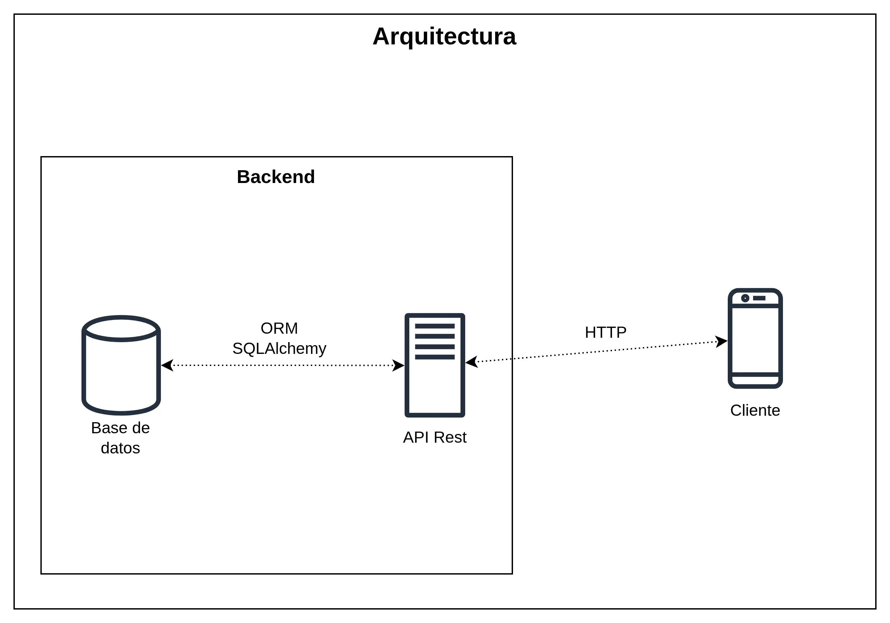
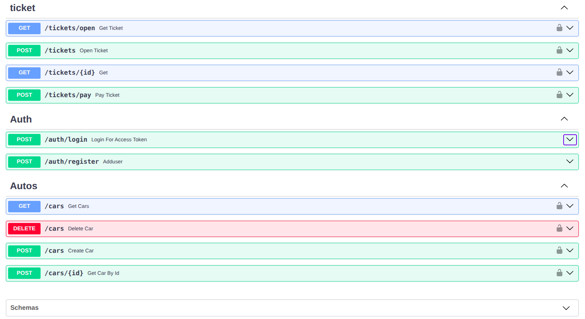
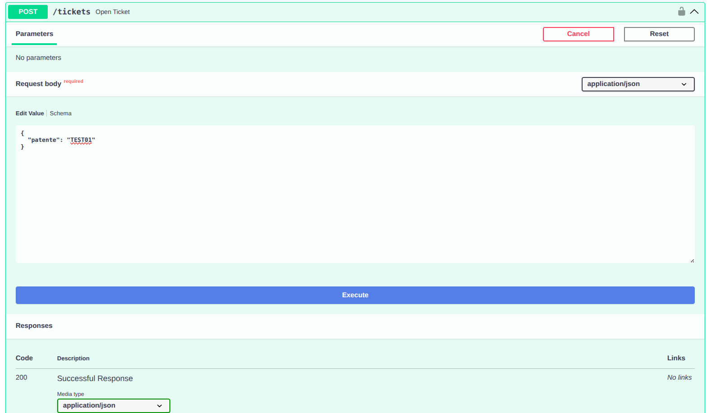
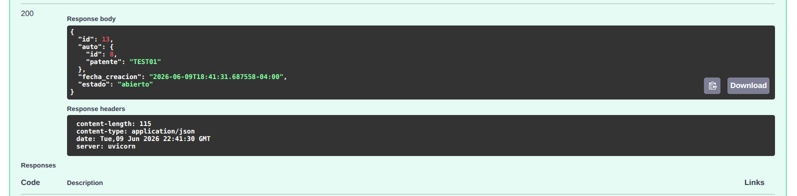
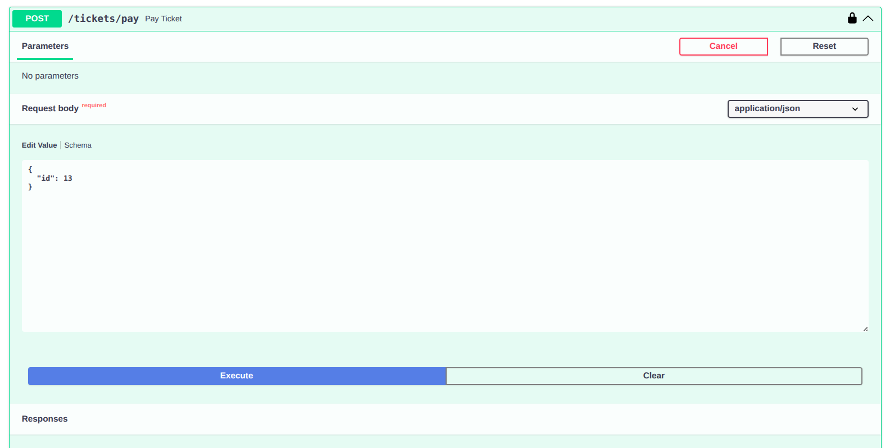
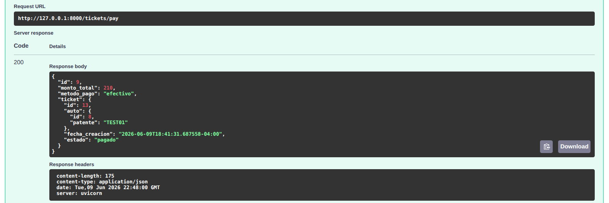

# Estacionamiento API

> Backend desarrollado para digitalizar la gestión de estacionamientos de pequeña escala, automatizando el control de ingresos, salidas y cálculo de cobros mediante una solución simple y de bajo costo.

---

## Objetivo del Proyecto

Desarrollar una API REST capaz de gestionar el ciclo completo de operación de un estacionamiento, desde el registro de ingreso de un vehículo hasta la generación de la boleta asociada al pago.

## Problemática

### Contexto

Muchos estacionamientos pequeños o de operación esporádica continúan gestionando sus vehículos de forma manual, utilizando registros físicos o procesos poco estructurados. Esto dificulta el control de ingresos y salidas, además de aumentar la posibilidad de errores al calcular los cobros asociados al tiempo de permanencia.

## Desafío

Desarrollar una solución simple y de bajo costo que permita registrar la entrada y salida de vehículos, automatizando el cálculo del cobro y centralizando la información de la operación.

### Problemas Detectados

- Registro manual de vehículos.
- Dificultad para controlar vehículos actualmente estacionados.
- Cálculo manual del tiempo de permanencia y su costo asociado.
- Soluciones comerciales con costos elevados para pequeños operadores.
- Necesidad de operar desde dispositivos móviles sin infraestructura compleja.

---

## Solución

### Descripción General

Estacionamiento API es una API REST desarrollada para la administración de estacionamientos de pequeña escala.

El proceso de ingreso se realiza mediante el registro de la patente del vehículo. Si la patente no existe en el sistema, se almacena automáticamente. Posteriormente se genera un ticket asociado al ingreso, registrando la fecha y hora de entrada junto con la tarifa configurada por minuto.

Al momento de la salida, el sistema utiliza la información del ticket para calcular automáticamente el tiempo de permanencia y el monto correspondiente a pagar.

La solución fue diseñada para ejecutarse sobre una infraestructura sencilla, permitiendo que múltiples usuarios puedan operar simultáneamente mediante un futuro cliente web o móvil.

## Funcionalidades Principales

- Autenticación mediante JWT.
- Autorización mediante OAuth2.
- Registro de vehículos mediante patente.
- Generación de tickets de estacionamiento.
- Control de ingresos y salidas.
- Cálculo automático del costo según tiempo de permanencia.
- Persistencia y consulta de información histórica.

## Beneficios

- Disminución de errores operativos.
- Automatización del cálculo de cobros.
- Registro centralizado de la operación.
- Bajo costo de implementación.
- Escalabilidad para múltiples operadores.

---

## Stack Tecnológico

- FastAPI
- PostgreSQL
- SQLAlchemy
- Alembic
- JWT
- OAuth2

---

## Diagrama BD

> Modelo de datos utilizado por la aplicación.

``` Entidades
Usuario
  |
Perfil

Auto
  |
Ticket
  |
Boleta
  |
Tarifa
```

---

## Arquitectura de Aplicación

### Vista General



## Explicación

### Cliente

Aplicación encargada de consumir la API para registrar ingresos y salidas de vehículos.

### Backend (Aplicación actual)

API REST desarrollada en FastAPI responsable de la autenticación, validaciones, lógica de negocio y acceso a datos.

### Base de Datos

PostgreSQL utilizada para almacenar vehículos, tickets y configuraciones del sistema.

---

## Endpoints de la aplicación

### Todos los endpoints



**Descripción**

> Captura correspondiente a todos los endpoints disponibles de la aplicación.

---

### Creación de Ticket




**Descripción**

> Captura correspondiente a la creación de un nuevo ticket. El cliente pasa mediante el método POST la patente correspondiente al auto que ha ingresado y el servidor genera y guarda los datos necesarios.

---

### Registro de Salida




**Descripción**

> Captura correspondiente al proceso de salida de un vehículo y cálculo automático del monto a pagar. El cliente envía el ID de ticket que desea realizar el pago. El servidor genera los cálculos y retorna la estructura de la boleta.

---

## Aprendizajes

Durante el desarrollo de este proyecto pude profundizar en:

- Diseño de una API REST para resolver un problema real de gestión de estacionamientos.
- Implementación de autenticación y autorización mediante JWT y OAuth2.
- Modelado de entidades y relaciones utilizando SQLAlchemy.
- Gestión de migraciones de base de datos con Alembic.

---
